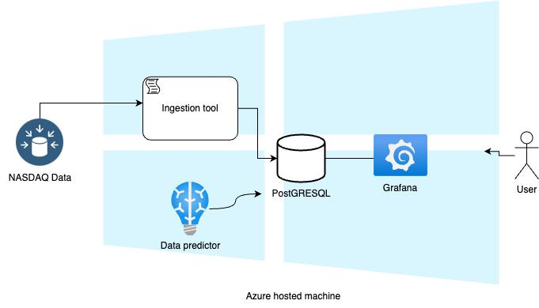
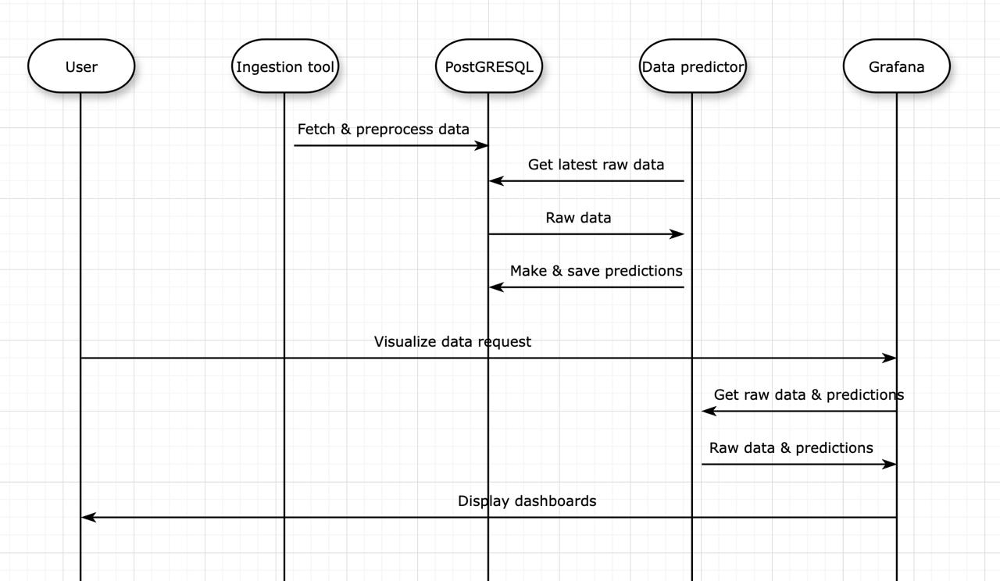
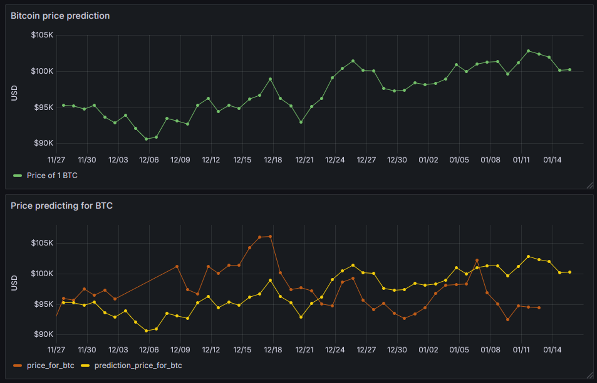
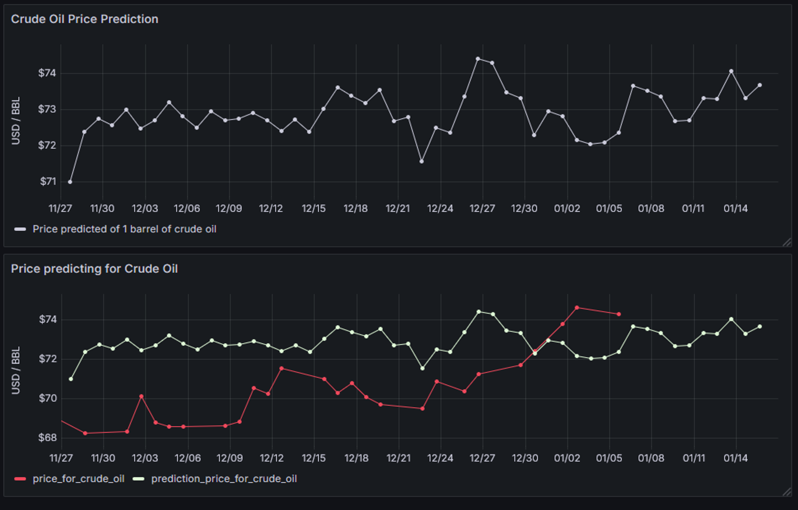

# 🔗 Bitcoin / Oil Price Correlation and Prediction
## 📊 An End-to-End Data Pipeline

### 👨‍💻 Authors:
**Victor Constantinescu, Cristian Cordos, Matei Neaga, Matei Popescu**  
🏛 **National University of Science and Technology POLITEHNICA Bucharest**  
📧 Emails: vconstantinescu2710@stud.acs.upb.ro, ioan.cordos@stud.acs.upb.ro, matei.neaga@stud.mec.upb.ro, matei_calin.popescu@stud.acs.upb.ro

📅 **Date:** February 28, 2025

---

## 📌 Overview
This project develops an **end-to-end data processing pipeline** using **Big Data technologies** to analyze the correlation between **Bitcoin** and **oil prices** and predict future trends. 

**Key Features:**
✅ Data acquisition from **public sources** 📡  
✅ Processing & storing in **PostgreSQL** 🗄️  
✅ Forecasting with **LSTM Neural Networks** 🤖  
✅ Data visualization using **Grafana** 📈  
✅ Deployment in **Microsoft Azure Cloud** ☁️  

---

## 🛠 Deployment Steps

### Step 1️⃣: Create a Debian VM on Azure
1. Log in to **Azure Portal**.
2. Create a new **Debian Virtual Machine**.
3. Configure **network security** to allow inbound traffic on port **3000** (for Grafana):
   - Go to **Networking > Inbound Port Rules**.
   - Add a new rule:
     - **Source:** Any (or specify your IP for security).
     - **Source Port Ranges:** *
     - **Destination:** Any.
     - **Destination Port Ranges:** **3000**.
     - **Protocol:** TCP.
     - **Action:** Allow.

### Step 2️⃣: Log in to the VM
```sh
chmod 600 cc-test_key.pem
ssh -i cc-test_key.pem azureuser@YOUR_VM_IP_ADDRESS
```

### Step 3️⃣: Install Prerequisites
#### 3.1 Install Docker 🐳
```sh
sudo su
apt update
apt upgrade -y
sudo apt install -y ca-certificates curl gnupg lsb-release
sudo mkdir -p /etc/apt/keyrings
curl -fsSL https://download.docker.com/linux/debian/gpg | sudo gpg --dearmor -o /etc/apt/keyrings/docker.gpg
echo "deb [arch=$(dpkg --print-architecture) signed-by=/etc/apt/keyrings/docker.gpg] https://download.docker.com/linux/debian $(lsb_release -cs) stable" | sudo tee /etc/apt/sources.list.d/docker.list > /dev/null
sudo apt update
sudo apt install -y docker-ce docker-ce-cli containerd.io docker-buildx-plugin docker-compose-plugin
docker --version
usermod -aG docker azureuser
systemctl enable docker
```

#### 3.2 Install PostgreSQL 🗄️
```sh
docker pull postgres
docker run --name postgres-container -e POSTGRES_USER=user -e POSTGRES_PASSWORD=password -e POSTGRES_DB=database -p 5432:5432 -v pg_data:/var/lib/postgresql/data -d postgres
docker exec -it postgres-container psql -U user -d database
docker stop postgres-container
docker rm postgres-container
```

#### 3.3 Install Pip & Python Dependencies 🐍
```sh
sudo apt install pip
sudo apt install python3.11-venv
python3 -m venv env-ibd
source env-ibd/bin/activate
pip install psycopg2-binary
```

#### 3.4 Install Grafana 📊
```sh
docker pull grafana/grafana
docker run -d -p 3000:3000 --name=grafana -v grafana_data:/var/lib/grafana grafana/grafana
```
🔗 **Grafana Credentials:**
- Open a browser and go to **http://localhost:3000**
- **Username:** admin  
- **Password:** admin (You’ll be prompted to change it on first login.)

#### 3.5 Create Docker Network for Grafana & PostgreSQL 🔗
```sh
docker network create grafana-postgres-net
docker network connect grafana-postgres-net postgres-container
docker network connect grafana-postgres-net grafana
```

---

## 📜 Table of Contents
1️⃣ **Introduction**  
2️⃣ **System Architecture**  
3️⃣ **Data Pipeline Components**  
   - LSTM Model 🧠  
   - Microservice Architecture 🏗️  
   - Data Ingestion 📥  
   - Data Visualization 📊  
4️⃣ **Results & Analysis**  
5️⃣ **Conclusions & Future Work**  

---

## 1️⃣ Introduction

🔎 This project has two main objectives:
1. **Analyze the relationship between Bitcoin and oil prices** and develop a **prediction model** based on their correlation.
2. **Develop a microservice-based web application** that enables rapid deployment and scalability.

📌 **Key Insights from Previous Studies:**
- **Higher oil prices** increase **Bitcoin mining costs** ⛏️
- **Bitcoin volatility** is linked to **oil price changes** 📉
- **Oil price fluctuations impact cryptocurrency returns** 💹
- **Bitcoin and oil move in the same direction** during bullish market conditions 📊

The **rise of microservice-based architectures** has also played a key role in modernizing cloud-based applications, enabling greater **scalability and resilience**.

---

## 2️⃣ System Architecture 🏗️

🚀 **Hosted on:** **Microsoft Azure Cloud** ☁️  
💻 **Virtual Machine Specs:** Standard **B4ms (4vCPUs, 16GB RAM)**  
🖥️ **OS:** Linux Debian 12 🐧  

### 🔹 **Main Components:**
1️⃣ **Ingestion Tool** 📥  
   - Python script that pulls data from external sources, processes it, and saves it into PostgreSQL.

2️⃣ **Data Predictor** 🤖  
   - LSTM-based neural network that **forecasts** Bitcoin and oil prices and updates the database.

3️⃣ **PostgreSQL Database** 🗄️  
   - Hosted in a **Docker container** for structured data storage.

4️⃣ **Grafana Dashboard** 📊  
   - Visualizes Bitcoin & oil price trends, correlations, and predictions.






---

## 3️⃣ Data Pipeline Components ⚙️

### 🔥 **3.1 LSTM Neural Network Design** (Victor Constantinescu)
📌 **Built using:** **TensorFlow + PostgreSQL** 🔗  
📌 **Workflow:**
1. Retrieves historical data from PostgreSQL 📊
2. Processes data (min-max scaling, removing nulls) 🔄
3. Trains **LSTM Model** using **5-sequence lookback** 🔍
4. Stores predictions back into the database 📥

**🔹 Model Parameters:**
- Dropout rate: **0.2** 🔄
- Activation: **ReLU** ⚡
- Optimizer: **Adam (LR = 0.001)** 🚀
- Epochs: **100** 📈
- Training/Test Split: **80% / 20%** 📊

### 🏗️ **3.2 Microservice Architecture** (Cristian Cordos)
💡 **Deployment Strategy:**
- Hosted on **Azure VM** 💻
- **Grafana & PostgreSQL** containerized using **Docker** 🐳
- **Python backend runs natively on the VM** 🐍

✅ **Benefits:**
- Modular & scalable 🔧
- Reduces dependency conflicts 🛠️
- Seamless integration between **microservices & databases** 🗄️

### 📊 **3.3 Data Visualization** (Matei Neaga)
🔎 **Visualization Framework:** **Grafana + PostgreSQL** 📈  

📌 **Insights from 15-year Bitcoin & oil price trends:**
- **Bitcoin surged** post-2020, reaching **$100K by late 2024** 🚀
- **Oil prices dropped sharply in 2020** due to the **pandemic**, then recovered 📉
- **Bitcoin & oil prices exhibit correlation** during certain market conditions 📊

### 📥 **3.4 Data Ingestion** (Matei Popescu)
📡 **Data Sources:**
- **Bitcoin:** Nasdaq Data Link API 🏦
- **Oil:** Western Texas Intermediate (WTI) 🌍

✅ **Automated Updates:**
- Data fetched **daily** ⏳
- Stored in PostgreSQL **as CSV** 🗂️
- **Cron job schedules updates every 24h** 🔄

---

## 4️⃣ Results & Analysis 📊

### 📈 **Key Findings:**
- **LSTM model effectively predicts trends** 📊
- **Bitcoin price correlation with oil is evident** 💹
- **Grafana dashboards provide real-time insights** 🔍

📌 **Visual Results:**
🖼 **Figure 1:** Bitcoin price trends (last 15 years)  
🖼 **Figure 2:** Oil price trends (last 15 years)  
🖼 **Figure 3:** Predicted vs Actual Oil Prices  
🖼 **Figure 4:** Predicted vs Actual Bitcoin Prices  

📌 **Prediction Performance:**
| Model | RMSE | MAE |
|-----------|---------|---------|
| Bitcoin | **3.21** | **2.89** |
| Oil | **2.45** | **1.99** |

📌 **Challenges & Improvements:**
- **Bitcoin’s volatility causes occasional prediction errors** 🔄
- **More historical data could enhance model accuracy** 📅
- **Regularization techniques could stabilize predictions** 🔧






---

## 5️⃣ Conclusions & Future Work 🚀

✅ **Project Achievements:**
- Built a **scalable & automated** data pipeline for **Bitcoin & oil price forecasting** 📊
- Successfully deployed **LSTM model** in a **microservices environment** 🏗️
- Created **interactive dashboards** for real-time monitoring 📈

📌 **Future Enhancements:**
- **Fine-tune LSTM model for better accuracy** 📉
- **Expand dataset to include more financial indicators** 📊
- **Deploy pipeline on Kubernetes for better scalability** ☁️
- **Integrate AI-based anomaly detection for financial risk alerts** 🔥

---

🚀 **This project demonstrates how AI-driven financial analysis can enhance decision-making in economic markets!** 🌎📈

